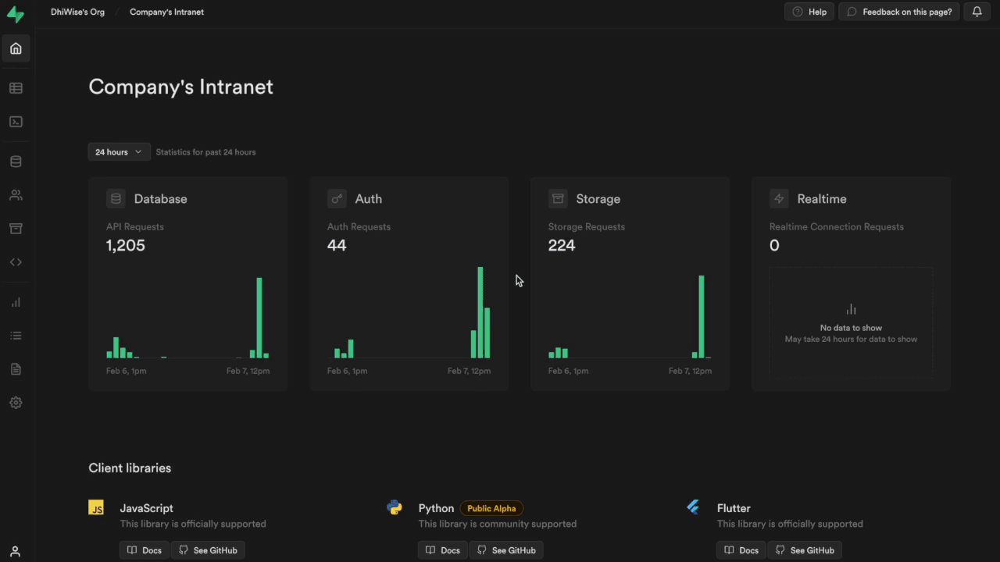

# 🏢Company Intranet

## **Open Source**, **Self-hosted** **and** **Free**

An internal hub used by companies to store essential and informative data, streamline key processes, and encourage team collaboration. In other words, it’s a space to gather all the company’s information on the same ground and keep them connected and well-synced.

**Admin Authentication Overview**



**User Authentication Overview**


**Admin panel overview**


**User panel overview**


**Admin Documents overview**


**Admin SpaceManagement overview**


**Admin ATS overview**


**User Documents overview**


**User SpaceManagement overview**


<br/>


# ✨ Features

 ADMIN

 ✅ ️Keka Employee Sync

 ✅ Send invite to new employee via Mail

 ✅ Create / Forgot password

 ✅ Role based access

 ✅ Show Employee list

 ✅ Edit Employees

 ✅ Search Employee

 ✅ Create, read, edit and delete a space

 ✅ Create, read, edit and delete bookings

 ✅ Filter bookings
 
 ✅ Onedrive,googledrive, and dropbox integration for file management 
 
 ✅ View all File-Folders as Parent-child structure.

 ✅ Upload, download,delete, and rename files 

 ✅ Create, rename, and delete folders

 ✅ View applications

 ✅ View application status
 


 CLIENT

✅ ️View spaces

✅ Book a space

✅ Delete booking

✅ Send space invitation via email

✅ Get track of new bookings and new applications by notifications

✅ Manage the available space resources

✅ View all files and folders

✅ Send XYZ mail automatically to the applicant on a new application

✅ Notify respective employees on recieving XYZ any application

✅ Accept/reject application

✅ Check other employee's acceptance/rejection on that application

✅ Vote calculation

✅ Notify HR

⭕ Employee Filter

⭕ Show Employee list on User Side

⭕ Manage space booking with google calendar

⭕ Advanced pagination while viewing space booking


<br/>

# 🔨 Build with


<a href="https://www.dhiwise.com" target="_blank"></a>

<a href="https://supabase.com" target="_blank"></a>


> ℹ️ **INFO**
You can differentiate the manual code from DhiWise-generated code by referring to the comments made in the code.

# 💾 Database


For this project, Supabase is used for data storage in back-end. Once you log in to Supabase, you will be asked to create a project.

<br/>

# 📖 Prerequisites

## Step 1: Create a project in Supabase.

Login to your Supabase account and create an empty project in Supabase

Go to `Supabase -> Projects -> New project`

Give your project a proper name, set a password to secure your project, and click `Create new project`.

## Step 2: Email configuration in Supabase project

Supabase provides some default email templates. Go to `Project dashboard -> Authentication -> **Email Templates**
You can modify them and use it as per the requirement.

`Invite User`

```html
<h2>You are invited</h2>

<p>You are invited to create a user on {{ .SiteURL }}. Follow this link to accept the invite:</p>
<p><a href="{{ .ConfirmationURL }}signup">Accept the invite</a></p>

<p>Regards,</p>
<p>Team CompanyIntranet/p>
```

`Reset Password`:

```html
<h2>Reset Password</h2>

<p>Follow this link to reset your password:</p>
<p><a href="{{ .ConfirmationURL }}changepassword">Reset Password</a></p>

<p>Regards,</p>
<p>Team CompanyIntranet/p>
```
> 📄 **Note:** To configure SiteURL, Go to Project Dashboard -> Authentication -> Configuration -> URL Configuration and configure your SiteURL

## Step 3: Create a storage bucket

Go to `Project dashboard -> Storage`; click on `📝 New bucket`.

Provide **bucket name** and set it **public**.

Now go to `Project dashboard → SQL Editor -> + New query` and RUN the following query to create policy.

```sql
create policy "Allow upload on <BUCKET_NAME>"
on storage.objects for insert
with check ( bucket_id = '<BUCKET_NAME>' );
```

> 📄 **Note:** Replace **<BUCKET_NAME>** with the name of your storage bucket. In this project, we've created three buckets namely space-management for storing space images, file-folders for storing files and employee-profile for storing employees profile.

## Step 4: Create tables and create public users

### Create tables:

Go to `Project dashboard -> SQL Editor -> + New query`.

And get the query from [here](https://github.com/devyp19/Company-Intranet/blob/main/queries-and-functions.md#create-tables) and paste it.

Now, click `RUN`.

This will create tables in your project.

To view the created tables go to; `Project dashboard -> Table Editor`.

### **Create public employees:**

This function duplicates data from the Supabase `auth.users` table to the `public.employe` table.

Go to `Project dashboard -> SQL Editor -> + New query`.

```sql
create or replace function public.handle_add_Employees()
returns trigger as $$
begin
  insert into public.employe (uuid, work_email)
  values (new.id, new.email);
  return new;
end;
$$ language plpgsql security definer;
```

After the function is created, run the following query in `Project dashboard -> SQL Editor -> + New query` to create a Trigger from the function.

```sql
create trigger on_invite_employee_add
  after update on auth.users
  for each row execute procedure public.handle_add_Employees();
```

> 📄 **Note**
> Once the tables are created, go to `Project dashboard → Authentication → Users` and click on `+ Invite` and provide the email ID of the admin user. Once the admin accepts the invite, he/she will be redirected to the Signup page, where admin needs to provide his/her password.

An admin user entry will be created in `public.employe` table change the type of that admin user to **2**.

> ℹ️
> In the user_type table, field label has below values <br/>
> *2* : Admin <br/>
> *3* : User<br/>


## Step 5: Functions and Triggers

Now, once the tables are created, **RUN** the following Functions.

Go to `Project dashboard -> SQL Editor -> + New query`.

Copy and paste the function query from here for the specific function.

Then, click `RUN`.

This will create a function. You can view this function from `Project dashboard → Database → Functions`.

### Functions:

> ⚠️ **Caution**
> Do not change the function names

> ℹ️ **Info**
> Function which requires arguments to be passed along will automatically take arguments after you run the query.

> 📄 **Note**
> Follow the same steps for all the below functions.

### Group and count applicants:

This function is used to count and group the applicants based on job title.

```sql

drop function if exists countApplicantsTechnologyWise;
create or replace function countApplicantsTechnologyWise() -- 1
returns  table(
  total bigint,
  job_title text
)  -- 2
language sql -- 3
as $$  -- 4
SELECT count(name),job_title
FROM applicants
group by job_title
$$; --6

```


### Triggers:

### **Insert into Notification table on new response:**

This function Inserts a records to the `notification` table when a new response is created in `google_response` table.

Create the function as shown below:

```sql

DECLARE name text = '';
BEGIN

select a.tech_tag into name from applicants a where a.id = new.applicants_id;

insert into notification (employe_id,response_id,applicant_id,notification_type) 
select id,new.id,new.applicants_id,2 from employe where name = any (string_to_array(tech_tag, ','));
return new;

END;   
```


After the function is created, create a Trigger from the function.


<br/>


# **🖥️ Local development**


Follow these simple steps to set up your project locally.

### Step 1: Get URL and API Key

In order to run this project we require 4 things from supabse. Following are the constant names that we've used in the application for them.

1. Common URL - `REACT_APP_SUPABSE_COMMON_URL`
2. Public API key - `REACT_APP_PUBLIC_API_KEY`
3. Secret API KEY - `REACT_APP_SECRET_API_KEY`
4. Reference ID - `REACT_APP_PROJECT_REFERENCE_ID`

Go to `Supabase -> Project dashboard → Settings → Project Settings → API`.

Under **Project URL**, you will find the `URL` as your **<SUPABASE_PROJECT_URL>**.

Under the **Project API keys** section, you will find the `anon` `public`  as your **<PROJECT_API_KEY>**  and `service_role` `secret` as your **<PROJECT_SERVICE_ROLE_KEY>**.

### Step 2: Clone the repo

```bash
git clone https://github.com/DhiWise/CompanyIntranet.git
```

##  API keys

To get API keys and url; firstly go to your project then select **Project Settings** from the left side menus.


In the API tab, **Project URL** is your `REACT_APP_SUPABSE_COMMON_URL`.
Below to the URL in Project API keys
 **anon public** key is your `REACT_APP_PUBLIC_API_KEY` and **service_role secret** key is your `REACT_APP_SECRET_API_KEY`.

For **Reference ID** Go to the `General tab -> Project Settings
 -> General settings`. Here **Reference ID** is your `REACT_APP_PROJECT_REFERENCE_ID`.


 To Sync **Keka** employees with Company Intranet 3 things are required.
 1. Keka API key - `REACT_APP_KEKA_API_KEY`
 2. Keka Client ID - `REACT_APP_KEKA_CLIENT_ID`
 3. Keka Secrent key - `REACT_APP_KEKA_CLIENT_SECRET_KEY`

To get these keys, please contact Keka.


### Step 3: Install NPM packages

```bash
npm i
```

**Packages used:**

📦 [moment](https://www.npmjs.com/package/moment) 🔗

📦 [lodash](https://www.npmjs.com/package/lodash) 🔗

📦 [@reduxjs/toolkit](https://www.npmjs.com/package/@reduxjs/toolkit) 🔗

📦 [react-redux](https://www.npmjs.com/package/react-redux) 🔗

📦 [redux-persist](https://www.npmjs.com/package/redux-persist) 🔗

📦 [react-modal](https://www.npmjs.com/package/react-modal) 🔗

📦 [@supabase/supabase-js](https://www.npmjs.com/package/@supabase/supabase-js) 🔗

📦 [dayjs](https://www.npmjs.com/package/dayjs) 🔗

📦 [bootstrap](https://www.npmjs.com/package/bootstrap) 🔗

📦 [react-tabs](https://www.npmjs.com/package/react-tabs) 🔗

📦 [yup](https://www.npmjs.com/package/yup) 🔗

📦 [env-cmd](https://www.npmjs.com/package/env-cmd) 🔗

📦 [react-circular-progressbar](https://www.npmjs.com/package/react-circular-progressbar) 🔗

📦 [react-confetti](https://www.npmjs.com/package/react-confetti) 🔗

📦 [react-minimal-side-navigation](https://www.npmjs.com/package/react-minimal-side-navigation) 🔗


### Step 4: Create a `.env`  file

Create the `.env` file in project folder then Add the below keys in file and replace the value of the keys as per the keys you have go.

```js
REACT_APP_SUPABSE_COMMON_URL = `ENTER_YOUR_SUPABASE_COMMON_URL_HERE/`
REACT_APP_PUBLIC_API_KEY = `ENTER_YOUR_PUBLIC_API_KEY_HERE`
REACT_APP_SECRET_API_KEY = `ENTER_YOUR_SECRET_API_KEY_HERE`
REACT_APP_PROJECT_REFERENCE_ID= `ENTER_YOUR_PROJECT_REFERENCE_ID_HERE`

REACT_APP_KEKA_API_KEY = `ENTER_YOUR_KEKA_API_KEY_HERE`
REACT_APP_KEKA_CLIENT_ID = `ENTER_YOUR_KEKA_CLEINT_ID_HERE`
REACT_APP_KEKA_CLIENT_SECRET_KEY = `ENTER_YOUR_CLIENT_SECRET_KEY_HERE`

REACT_APP_FRESHTEAM_TOKEN = `ENTER_YOUR_FRESHTEAM_TOKEN_HERE`

```

### Step 5: Run index.js file in server folder

This backend provides support for enabling CORS, for accessing Freshteam, Keka and Google Form API's and for sending emails.
Run it as a standalone backend.
Run these commands to start the server:

```bash
npm i
node index.js
```

To start a local copy of the application on port `3000`:

```bash
npm start
```

<br/>

# 🤝 **Contributing**


If you don't have git on your machine, [install it](https://docs.github.com/en/get-started/quickstart/set-up-git).

1. Fork the Project
2. Create your Feature Branch (`git checkout -b your-branch-name`)
3. Commit your Changes (`git commit -m 'commit-message'`)
4. Push to the Branch (`git push origin your-branch-name`)
5. Open a Pull Request

<br/>

# ⚖️ **License**

## MIT License

Copyright©️ 2022 DhiWise

Permission is hereby granted, free of charge, to any person obtaining a copy of this software and associated documentation files (the "Software") to deal in the Software without restriction, including without limitation the rights to use, copy, modify, merge, publish, distribute, sublicense, and/or sell copies of the Software, and to permit persons to whom the Software is furnished to do so, subject to the following conditions:

The above copyright notice and this permission notice shall be included in all copies or substantial portions of the Software.

THE SOFTWARE IS PROVIDED "AS IS" WITHOUT WARRANTY OF ANY KIND, EXPRESS OR IMPLIED, INCLUDING BUT NOT LIMITED TO THE WARRANTIES OF MERCHANTABILITY, FITNESS FOR A PARTICULAR PURPOSE AND NON-INFRINGEMENT. IN NO EVENT SHALL THE AUTHORS OR COPYRIGHT HOLDERS BE LIABLE FOR ANY CLAIM, DAMAGES OR OTHER LIABILITY, WHETHER IN AN ACTION OF CONTRACT, TORT OR OTHERWISE, ARISING FROM, OUT OF OR IN CONNECTION WITH THE SOFTWARE OR THE USE OR OTHER DEALINGS IN THE SOFTWARE.

<br/>

# 💬 **Community**

<a href="https://twitter.com/dhiwise" target="_blank"></a> &nbsp;&nbsp;&nbsp;&nbsp;
<a href="https://discord.com/invite/hTuNauNjyJ" target="_blank"></a> &nbsp;&nbsp;&nbsp;&nbsp;
<a href="https://www.youtube.com/@DhiWise" target="_blank"></a> &nbsp;&nbsp;&nbsp;&nbsp;
